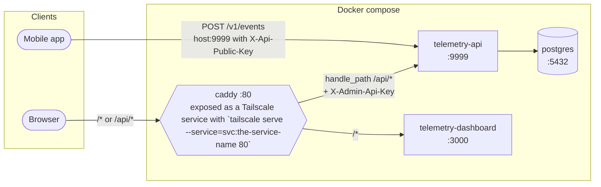

# Omoide Memo (OSS)

Self-hosted telemetry stack. Go API, Nuxt dashboard, TypeScript SDK generation.

## Packages

- `packages/telemetry-api` : api to ingest and fetch telemetry events.
- `packages/telemetry-dashboard` : internal dashboard for viewing telemetry events.
- `packages/telemetry-sdk` : configuration for the SDK generation based on the API's OpenAPI spec.

## Run with Docker (prod)

Topology:

- Caddy on `:80` is the only thing on the host's port 80. It forwards `/api/*` to `API_PROXY_TO` and reverse-proxies every other path to the dashboard.
- The telemetry-api container publishes `9999:9999` directly on the host — it does not go through caddy.
- Postgres is on the internal docker network only.



```
# example, adapt to match prod env
cp .env.example .env
docker compose up --build
```

- Dashboard: `http://localhost/`
- API: `http://localhost:9999/v1/events` (host port) or `http://localhost/api/v1/events` (via caddy, with admin key injected)

## Run locally (dev)

Hot-reload dev server for the API + dashboard via `mise` + `mprocs`.

Prereqs: `mise`, `pnpm`, `docker` (for Postgres + the API's testcontainers).

```
mise run dev
```

This:

1. Generates the OpenAPI spec from the API source.
2. Generates the SDK into the dashboard.
3. Starts both processes under `mprocs` (API on `:9999`, dashboard on `:3000`).

## Seed demo data

In another terminal:

```
cd packages/telemetry-dashboard
pnpm seed
```

Generates sample data to start using the dashboard.

## How the dashboard authenticates (prod only)

In prod the dashboard handles every path except `/api/*` (which caddy forwards to the API). Its own API calls go to `/api/*`, which caddy forwards to `API_PROXY_TO` (default `telemetry-api:9999`) and adds `X-Admin-Api-Key: ${TELEMETRY_ADMIN_API_KEY}` from the caddy container before forwarding (see `Caddyfile`). The browser never sees or holds the admin key — it only sees the same-origin request to `/api/*`.

In dev (`mise run dev`) there is no caddy and no header injection. The dashboard plugin uses `import.meta.env.DEV` to point its `baseUrl` straight at `http://localhost:9999`.
